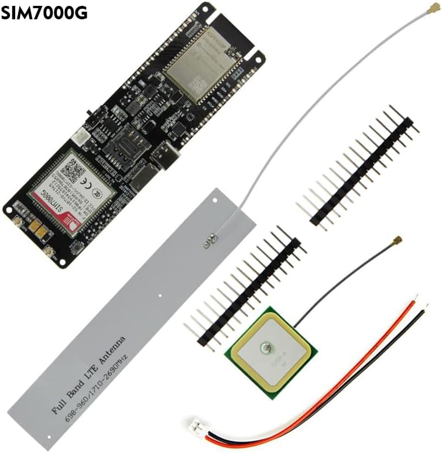
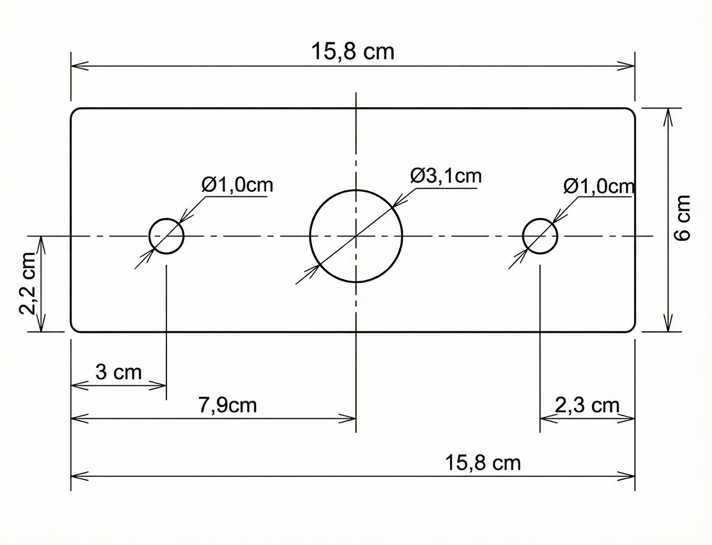
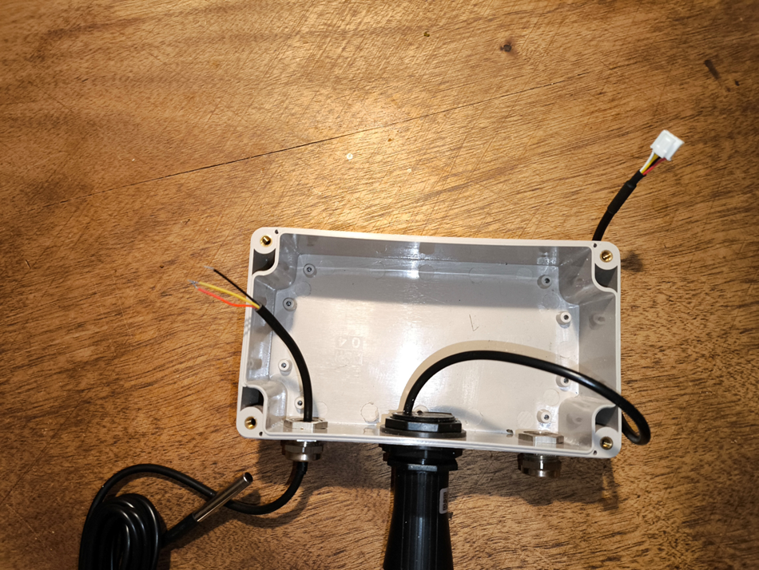
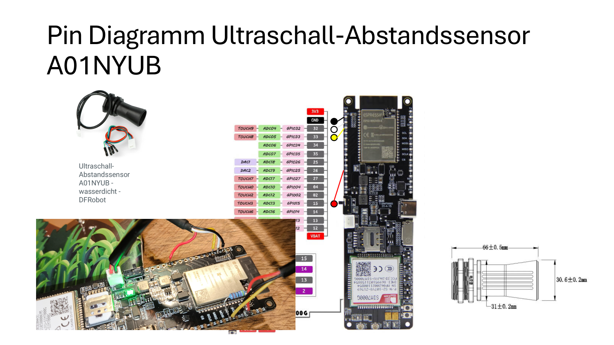
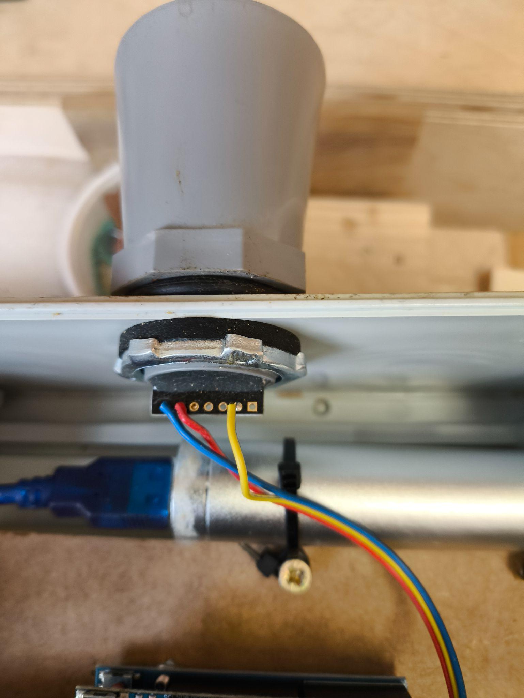
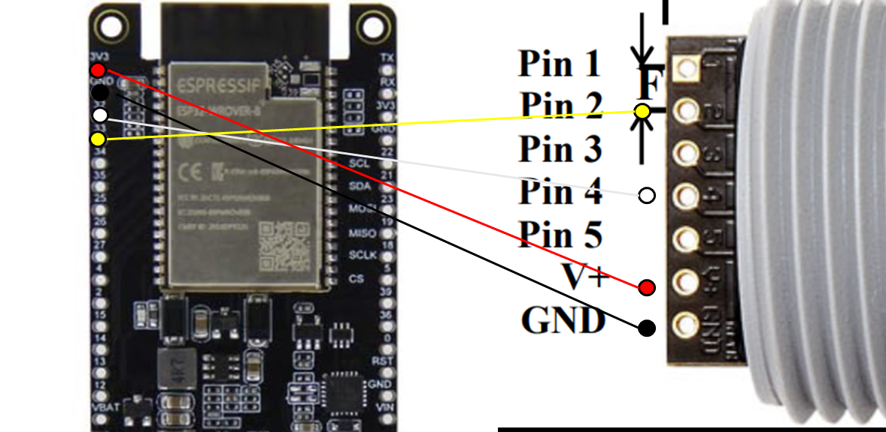
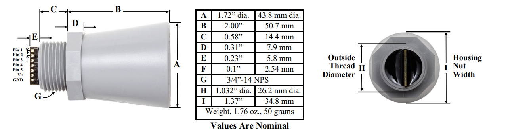
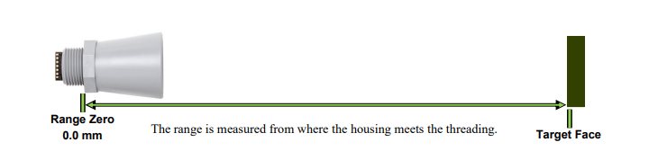
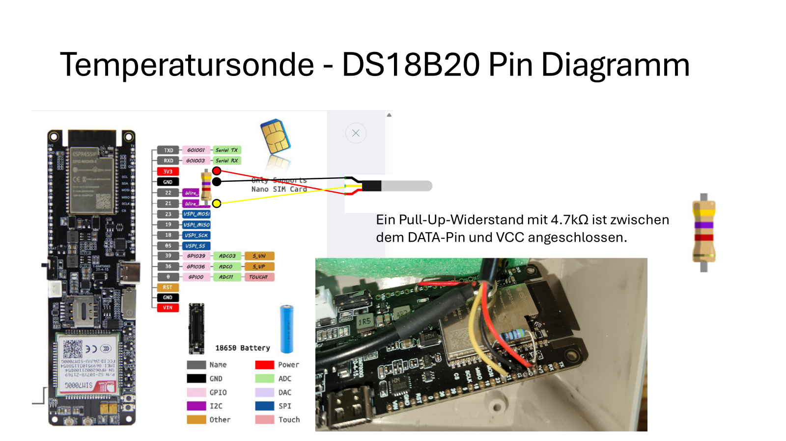
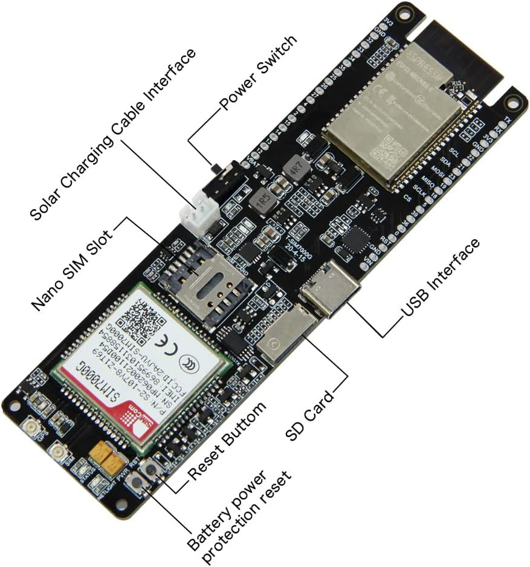

# OpenRiverSense (ORS) — Vollständige Anleitung

**Stand: Februar 2026 | Autoren: Urs Bösche, Christoph Rendel, Carsten Bösche**

---

## Inhaltsverzeichnis

1. [Übersicht](#übersicht)
2. [Werkzeugliste](#werkzeugliste)
3. [Materialliste & Bestelllinks](#materialliste--bestelllinks)
4. [Schritt 1: Gehäuse — Montage & Kabeldurchführung](#schritt-1-gehäuse--montage--kabeldurchführung)
5. [Schritt 2: Ultraschallsensor verkabeln](#schritt-2-ultraschallsensor-verkabeln)
   - [Option A: DFRobot A01NYUB](#option-a-dfrobot-a01nyub)
   - [Option B: Maxbotix MB7369](#option-b-maxbotix-mb7369)
6. [Schritt 3: Temperatursonde DS18B20 anschließen](#schritt-3-temperatursonde-ds18b20-anschließen)
7. [Schritt 4: Solarpanel mit JST-Stecker verbinden](#schritt-4-solarpanel-mit-jst-stecker-verbinden)
8. [Schritt 5: Antenne, SIM & Inbetriebnahme](#schritt-5-antenne-sim--inbetriebnahme)
9. [Schritt 6: Endmontage & Verschließen](#schritt-6-endmontage--verschließen)
10. [Neue Pegelmessstation im ORS-Server anlegen](#neue-pegelmessstation-im-ors-server-anlegen)
11. [Firmware auf den Sensor übertragen](#firmware-auf-den-sensor-übertragen)
12. [BLE-Konfiguration des Sensors](#ble-konfiguration-des-sensors)
13. [Installation vor Ort & Nacharbeiten](#installation-vor-ort--nacharbeiten)
14. [Pin-Belegung — Übersicht](#pin-belegung--übersicht)

---

## Übersicht

Der **OpenRiverSense (ORS)** ist ein solarbetriebener, autarker Pegelsensor auf Basis des **LILYGO T-SIM7000G ESP32**-Boards. Er misst per Ultraschall den Wasserstand und per DS18B20 die Wassertemperatur. Die Daten werden über das Mobilfunknetz (2G / NB-IoT) per MQTT an den ORS-Server gesendet. Zwischen den Messzyklen befindet sich der Sensor im Deep-Sleep-Modus, um den Energieverbrauch zu minimieren.

Die Konfiguration erfolgt komfortabel per **Bluetooth Low Energy (BLE)** über einen Chrome-Browser — kein spezielles Tool oder App nötig.

---

## Werkzeugliste

| Kategorie | Werkzeug / Material | Wofür? |
|---|---|---|
| **Gehäusebearbeitung** | Standbohrmaschine oder Akkuschrauber | Basis für alle Bohrarbeiten |
| | Stufenbohrer (Kegelbohrer) | Saubere, rissfreie Löcher in das Plastikgehäuse bohren (für M12-Verschraubungen und Ultraschallsensor). Normale Bohrer reißen Plastik oft auf. |
| | Entgrater / Rundfeile | Bohrlöcher glätten, damit Dichtungen perfekt sitzen |
| **Verkabelung (Löten)** | Lötstation (regelbar) | Empfindliche Pins am ESP32 nicht überhitzen |
| | Lötzinn | Dauerhafte, vibrationsfeste Verbindungen |
| | „Dritte Hand" (Löthilfe) | Optional — Halteklammern mit Lupe. Unverzichtbar beim Löten an Sensoren. |
| **Verkabelung (Kabel)** | Abisolierzange | Isolierung perfekt entfernen, ohne Kupferadern zu beschädigen |
| | Seitenschneider | Präzises Abschneiden von Kabeln und Kabelbindern |
| **Isolierung & Schutz** | Schrumpfschlauch-Set | Über Lötstellen schieben und erhitzen — schützt vor Kurzschluss und Feuchtigkeit |
| | Heißluftpistole (oder Feuerzeug) | Schrumpfschläuche schrumpfen |
| **Messen & Testen** | Digitales Multimeter (optional) | Solar-Spannung, Akku-Ladung und Durchgangsprüfung bei kalten Lötstellen |
| **Sicherheit** | Schutzbrille | Beim Bohren und Abknipsen fliegen oft Teile weg |

---

## Materialliste & Bestelllinks

| Kategorie | Komponente | Details | Bezugsquelle |
|---|---|---|---|
| **Mikrocontroller** | LILYGO T-SIM7000G | ESP32 Board mit 2G/NB-IoT & GPS, inkl. Antenne | [Amazon](https://www.amazon.de/LILYGO-Development-ESP32-WROVER-B-Wireless-T-SIM7000G/dp/B099RQ7BSR) |

> ⚠️ **ACHTUNG — LTE-Antenne nicht abreißen!**
> Im Lieferumfang liegt ein flaches, silbernes Rechteck bei, das wie eine Verpackung oder ein Aufkleber aussieht. **Das ist die LTE-Antenne!** Sie wird später an das Board angeschlossen und ist für die Mobilfunkverbindung zwingend erforderlich. **Bitte NICHT wegwerfen oder abreißen.** Ohne diese Antenne kann der Sendeverstärker des Moduls beim Einschalten sofort durchbrennen.

| **Sensoren** | DS18B20 Temp-Sensor | Wasserdicht, Edelstahl, 5 m Kabel | Amazon |
| **Sensoren (Distanz)** | DFRobot A01NYUB | Ultraschall, wasserdicht (Option 1) | Botland |
| **Sensoren (Distanz)** | Maxbotix HRXL-MaxSonar (MB7369) | Wetterbeständig, robust (Option 2) | RobotShop |
| **Stromversorgung** | 3,7 V Akkus (2er Pack) | Li-Ion 18650 Akkus (Flat-Top) | Amazon |
| **Solar** | 6 W Solar Panel | 5 V Output, IP65 wasserdicht | Amazon |
| **Solar (Alternativ)** | Reolink Solar Panel | Wetterfestes Panel | Amazon |
| **Gehäuse** | Junction Box | 15,8 × 9 × 6 cm, IP65 wasserdicht | Amazon |
| **Montage** | Maxbotix Zubehör | Halterung für Außenbereich | RobotShop |
| **Zubehör** | Kabelverschraubungen (M12) | Set, IP68 | Amazon |
| **Zubehör** | Silica-Gel | Hilft Kondenswasser zu binden | — |
| **Zubehör** | 4,7 kΩ Widerstand | Pull-Up für DS18B20 Datenleitung | — |

---

## Schritt 1: Gehäuse — Montage & Kabeldurchführung

In diesem Schritt verbaust du die mechanischen Schnittstellen in das Gehäuse, um die Elektronik später vor Regen und Staub zu schützen.

### 1.1 Bohrungen

- Nutze den **Stufenbohrer**, um die Öffnungen für die M12-Verschraubungen (seitlich) und den Ultraschallsensor (mittig) auf das exakte Maß zu bringen.
- Entferne Kunststoffspäne gründlich, damit die Dichtungen später plan aufliegen.

> **Tipp:** Zunächst kleine Löcher vorbohren, dann mit dem Kegelbohrer aufweiten. Anschließend die Ränder entgraten (Entgrater oder Cutter).

### 1.2 Einbau des Ultraschallsensors (Mitte)

1. Führe das Kabel des Ultraschallsensors (z. B. DFRobot A01NYUB) von **außen** durch die mittlere Bohrung.
2. Schiebe den Sensor bis zum Anschlag ein und fixiere ihn von der **Innenseite** mit der großen Kunststoff-Kontermutter.
3. **Wichtig:** Achte darauf, dass die Gummidichtung an der Außenseite sauber am Gehäuse anliegt.

### 1.3 Installation der Kabelverschraubungen

1. Setze die M12-Verschraubungen in die verbleibenden Löcher ein.
2. Verschraube sie von innen mit den Muttern. Fest anziehen, aber **nicht überdrehen** — das Plastikgehäuse könnte sonst reißen.

### 1.4 Durchführung der Kabel (Temperatur & Solar)

**Temperatursonde (DS18B20):**
- Führe das Kabel durch die **linke** Verschraubung.
- Lasse im Inneren ca. **10 cm Puffer**, um das Board später bequem anschließen zu können.

**Solarpanel:**
- Schneide den Stecker des Solarpanels ab.
- Führe das Kabel durch die **rechte** Verschraubung in das Gehäuse.
- **Wichtig:** Bevor du es mit dem beim LILYGO mitgelieferten Anschlusskabel für das Energiemanagement verlötest, stelle sicher, dass die Kabel **Plus (+)** und **Minus (-)** korrekt verbinden.

### 1.5 Abdichtung (Finalisierung)

1. Drehe die äußeren Kappen der Kabelverschraubungen (Überwurfmuttern) im Uhrzeigersinn fest.
2. Du wirst merken, wie sich der interne Gummiring fest um das Kabel legt — dies sorgt für die nötige **Zugentlastung** und die **IP65-Wasserdichtigkeit**.

---

## Schritt 2: Ultraschallsensor verkabeln

Es stehen zwei Ultraschallsensor-Optionen zur Verfügung. Wähle **eine** der beiden Varianten.

### Option A: DFRobot A01NYUB

#### Kabel identifizieren

Vergewissere dich, dass du die Adern Weiß und Gelb richtig zugeordnet hast.

#### Löten (Schritt-für-Schritt)

1. **Masse zuerst (Schwarz ⚫):**
   Löte das schwarze Kabel an den **GND**-Pin auf dem Board. Das ist die Basis, damit der Stromkreis geschlossen ist.

2. **Stromversorgung (Rot 🔴 an Pin 15):**
   Such dir den **Pin 15** (GPIO 15). Löte das rote Kabel dort an.

3. **Datenleitungen (Weiß ⚪ und Gelb 🟡):**
   - Löte das **weiße** Kabel an **Pin 32**.
   - Löte das **gelbe** Kabel an **Pin 33**.
   - Achte besonders darauf, dass du keine „Zinnbrücke" zwischen Pin 32 und 33 baust, da diese Pins auf dem Board oft direkt nebeneinander liegen.

#### Pin-Belegung A01NYUB

| Kabel-Farbe | Funktion | Ziel-Pin (ESP32 Board) |
|---|---|---|
| ⚫ Schwarz | GND (Masse) | GND |
| 🔴 Rot | VCC (Strom) | **Pin 15** (Nicht 3V3/5V!) |
| ⚪ Weiß | Data (RX/TX) | **Pin 32** |
| 🟡 Gelb | Data (TX/RX) | **Pin 33** |

#### Kontrolle

- Schau mit Lupe oder gutem Licht auf Pin 32 und 33 — sie **dürfen sich nicht berühren**.
- Prüfe Pin 15: Sitzt das rote Kabel fest?

---

### Option B: Maxbotix MB7369

> Alternativ zum DFRobot A01NYUB (Schritt 2, Option A).

Im Gegensatz zu den günstigeren Sensoren hat der Maxbotix **keinen festen Kabelbaum**. Du musst die Kabel an die Löt-Augen am Sensor anbringen.

**Wichtig:** Schau auf die Rückseite der Sensor-Platine. Die Pins sind dort klein mit Zahlen von 1 bis 7 beschriftet. Wir benötigen nur die **Pins 2, 4, 6 und 7**.

#### Pin-Zuordnung Maxbotix

| Maxbotix Pin | Funktion | Ziel auf dem ESP32 Board |
|---|---|---|
| Pin 6 | V+ (Stromversorgung) | **3V3** (3,3 Volt Pin) |
| Pin 7 | GND (Masse) | **GND** |
| Pin 4 | RX (Start-Signal) | **Pin 32** (im Code: `TRIG_PIN`) |
| Pin 2 | PW (Pulse Width Signal) | **Pin 33** (im Code: `ECHO_PIN`) |

> **Hinweis:** Die Pins 1, 3 und 5 bleiben leer.

#### Lötanleitung

1. **Sensor vorbereiten:**
   - Identifiziere die Nummern 6, 7, 4 und 2 auf der Rückseite des Sensors.
   - Löte jeweils ein Kabel an diese vier Kontakte. (Am besten unterschiedliche Farben, z. B. Rot für 6, Schwarz für 7).

2. **Durchführung:**
   - Führe diese Kabel durch die mittlere Bohrung in das Gehäuse und verschraube den Sensor wie in Schritt 1.2 beschrieben.

3. **Anschluss an das Board:**
   - **Strom (Pin 6 & 7):** Löte das Kabel von Sensor-Pin 6 an **3V3** und Sensor-Pin 7 an **GND** auf dem Board.
     > *Info:* Wir nutzen hier Dauerstrom (3V3) statt Pin 15, da wir den Sensor über die Datenleitung in den Schlafmodus schicken können.
   - **Steuerung (Pin 4 / RX):** Löte das Kabel von Sensor-Pin 4 an **Pin 32**.
   - **Messwert (Pin 2 / PW):** Löte das Kabel von Sensor-Pin 2 an **Pin 33**. Über diese Leitung sendet der Sensor die Entfernung als Impuls zurück.

#### Kontrolle

- Prüfe, ob sich beim Löten am Sensor kleine **Zinnbrücken** zwischen den engen Pins gebildet haben (besonders zwischen Pin 6 und 7 wäre das fatal).
- **Isoliere** die Lötstellen am Sensor (falls offen) mit Schrumpfschlauch oder Heißkleber, damit sie nicht korrodieren.

> Datenblatt: https://maxbotix.com/pages/hrxl-maxsonar-wr-datasheet

---

## Schritt 3: Temperatursonde DS18B20 anschließen

### 3.1 Kabel & Widerstand vorbereiten

- **Kabel:** Die drei Adern des Sensors (Rot, Schwarz, Gelb) abisolieren und die Spitzen verzinnen.
- **Widerstand (4,7 kΩ):** Biege die Beine des Widerstands so zurecht, dass sie die Distanz zwischen Pin 21 und dem 3V3-Pin überbrücken können. Wenn die Pins auf dem Board weit auseinander liegen, evtl. Isolierschlauch über die Beine ziehen, damit sie keine anderen Pins berühren.

### 3.2 Löten (Die Reihenfolge macht's einfacher)

1. **Masse zuerst (Schwarz ⚫):**
   Löte das schwarze Kabel an einen freien **GND**-Pin. Damit ist die Masseverbindung sicher.

2. **Datenleitung & erstes Widerstandsbein (Gelb 🟡 an Pin 21):**
   - Das ist der erste „Doppel-Anschluss".
   - Stecke das gelbe Kabel zusammen mit einem Bein des Widerstands an den **Pin 21** (oder verdrille sie vorher leicht).
   - Löte beide zusammen am Pin 21 fest.
   - Jetzt hängt der Widerstand an Pin 21, das andere Ende ist noch frei.

3. **Strom & zweites Widerstandsbein (Rot 🔴 an 3V3):**
   - Nimm das rote Kabel und das andere (freie) Bein des Widerstands.
   - Führe beide zum **3V3**-Pin.
   - Löte sie dort fest.

### Pin-Belegung Temperatursensor

| Kabel (Sensor) | Funktion | Ziel-Pin (ESP32 Board) |
|---|---|---|
| ⚫ Schwarz | GND (Masse) | GND |
| 🔴 Rot | VCC (Strom) | **3V3** |
| 🟡 Gelb | Data (Signal) | **Pin 21** |
| Widerstand (4,7 kΩ) | Pull-Up | Brücke zwischen **3V3** und **Pin 21** |

### 3.3 Wichtige Sicherheitskontrolle

Da der Widerstand nun „nackt" über dem Board oder zwischen den Kabeln hängt:

- **Kurzschluss-Gefahr:** Achte penibel darauf, dass die metallischen Beine des Widerstands **keine anderen Pins** auf dem Board berühren. Das passiert leicht, wenn man das Board ins Gehäuse drückt.
- **Isolierung:** Am besten Schrumpfschlauch über den ganzen Widerstand schieben, oder nach dem Löten Isolierband darunter/darüber kleben.

---

## Schritt 4: Solarpanel mit JST-Stecker verbinden

### 4.1 Solar-Kabel vorbereiten

1. **Kappen:** Schneide den USB-Stecker des Solarpanels ab.
2. **Abmanteln:** Entferne vorsichtig ca. 3 cm der schwarzen Außenhülle.
3. **Adern:** Du findest meist Rot (+) und Schwarz (-). Die Datenleitungen (oft Weiß/Grün) kurz abschneiden — sie werden nicht benötigt.
4. **Abisolieren:** Lege ca. 5 mm der Kupferlitzen bei Rot und Schwarz frei.

### 4.2 Verbindung mit dem JST-Kabel (Spleißen)

Nimm das dem Board beiliegende Kabel mit dem weißen Stecker.

1. **Vorbereitung:** Schiebe Schrumpfschlauch über die Kabelenden (**bevor du lötest!**).
2. **Löten:**
   - Verbinde das **rote** Kabel des Panels mit dem **roten** Kabel des Steckers.
   - Verbinde das **schwarze** Kabel des Panels mit dem **schwarzen** Kabel des Steckers.
3. **Isolieren:** Schiebe den Schrumpfschlauch über die Lötstellen und schrumpfe ihn fest (Feuerzeug oder Heißluft).

### 4.3 Sicherheits-Check (Polarität)

> Das ist der wichtigste Schritt, da Solarpanels und Board-Hersteller manchmal unterschiedliche Belegungen für „Links" und „Rechts" am Stecker haben.

1. Halte das Solarpanel kurz ins Licht.
2. Nimm dein **Multimeter** und miss vorne an den metallischen Kontakten des JST-Steckers.
3. Vergewissere dich, dass **Rot wirklich PLUS** liefert und **Schwarz MINUS**.
4. Stimmt die Polung? Perfekt.

### 4.4 Anschließen

Stecke den JST-Stecker fest in die dafür vorgesehene **Solar-Buchse** auf dem Board.

> Damit wird dein Akku nun sicher über den integrierten Laderegler des Boards geladen.

---

## Schritt 5: Antenne, SIM & Inbetriebnahme

> **Dieser Schritt ist kritisch. Bitte halte die Reihenfolge genau ein, um das Board nicht zu beschädigen.**

### 5.1 LTE-Antenne anbringen (WICHTIG!)

- Verbinde die flache LTE-Antenne mit dem Anschluss auf dem Board (meist beschriftet mit **LTE** oder **MAIN**).

> ⚠️ **ACHTUNG: Das LILYGO-Board darf NIEMALS mit Strom versorgt werden (weder per USB noch per Akku), wenn diese Antenne nicht angeschlossen ist! Ohne Antenne kann der Sendeverstärker des Moduls sofort durchbrennen.**

- **GPS-Antenne:** Die quadratische GPS-Antenne schließen wir **nicht** an. Da GPS sehr viel Energie benötigt, lassen wir sie weg, um die Akkulaufzeit deutlich zu verlängern.

### 5.2 SIM-Karte einlegen

1. Schiebe deine **Nano-SIM-Karte** in den Slot auf der Oberseite.
2. Achte auf die richtige Orientierung (die abgeschrägte Ecke zeigt meist nach außen/oben, siehe kleine Gravur auf dem Metall-Slot).

### 5.3 Batterien einlegen

1. **Erst wenn die LTE-Antenne fest sitzt**, legst du die beiden **18650 Akkus** in den Batteriehalter auf der Rückseite ein.
2. **Polarität prüfen:** Achte penibel auf die + und - Markierungen im Halter. Falsch eingelegte Akkus können das Board zerstören und sind brandgefährlich.

---

## Schritt 6: Endmontage & Verschließen

Jetzt kommt alles in die Box.

1. **Befestigung:** Fixiere das Board und die losen Kabel (z. B. mit Heißkleber oder Klebeband) im Gehäuse, damit bei Bewegung nichts klappert oder abreißt.

2. **Feuchtigkeitsschutz (optional):** Lege ein Päckchen **Silica-Gel** (Trockenmittel) mit in die Box, um eventuelle Kondensfeuchtigkeit aufzusaugen.

3. **Zuschrauben:**
   - Prüfe, ob die Gummidichtung im Deckel sauber sitzt.
   - Schraube den Deckel mit den 4 Schrauben fest.
   - Zieh die äußeren Muttern der Kabelverschraubungen (M12) noch einmal fest nach.

> **FERTIG!** Die Hardwarekomponenten sind nun alle verbaut. Jetzt wird der Sensor im ORS-Server registriert und die Firmware aufgespielt.

---

## Neue Pegelmessstation im ORS-Server anlegen

### Hardware beschaffen

- Besorge die nötigen Teile und baue den Sensor nach dieser Anleitung zusammen, **oder**
- besorge einen fertigen Sensor.

### Ort aussuchen

1. Suche einen interessanten Ort in der Nähe aus.
2. Kläre die **Genehmigung** ab.
3. Überlege dir einen geeigneten Halteapparat und baue diese Halterung.

### Im ORS-Server registrieren

1. Suche einen **markanten Namen** für den Sensor aus.
2. Melde dich bei **ORS** an.
3. Wähle **„Sensor registrieren"** an.
4. Fülle die Anmeldeseite aus: **Name**, **Beschreibung**, **Lage des Sensors**.
5. Die Angabe „Höhe des Sensors" wird sinnvollerweise **nach der Installation** nachgetragen.
6. **Speichere** die Angaben.
7. Dabei wird eine aus dem Namen gebildete **SensorID** zugewiesen — diese merken!
8. Von der Folgeseite das **binäre Programm** (Firmware) für den Sensor auf einen lokalen Computer herunterladen.

---

## Firmware auf den Sensor übertragen

### Was wird benötigt?

Die fertige Firmware liegt bereits im Repository unter **`ORS_05/build/ORS_05.ino.merged.bin`**. Diese eine Datei enthält bereits alles (Bootloader, Partitionstabelle und Firmware) — die Arduino IDE wird **nicht** benötigt.

### Übertragung per Web-Flasher

1. Die Seite **ESPTool.spacehuhn.com** aufrufen.

   > Die Übertragung geht nur mit einem **Chrome Browser**. Ohne Chrome gibt es diverse andere Lösungen im Internet, die jeweils für eine bestimmte Konfiguration helfen können.

2. Den Sensor per **USB-Kabel** am Computer anschließen und den **Ein-/Aus-Schalter** am Board einschalten.
3. Auf **„Connect"** klicken und im Browser-Popup den seriellen Port des Sensors auswählen.
4. Die heruntergeladene **Binärdatei** (`ORS_05.ino.merged.bin`) anwählen.
5. Als **Startadresse `0x0`** eingeben (Null).
6. Den **Flash-Vorgang starten** und warten, bis er abgeschlossen ist.
7. Nach dem Flashen die **Reset-Taste** kurz drücken, damit der Sensor mit der neuen Firmware startet.

### Fehlerbehebung: „Couldn't sync to ESP. Try resetting."

Dieser Fehler bedeutet, dass der ESP32 keine Verbindung zum Flasher aufbauen konnte. Mögliche Ursachen und Lösungen:

1. **Ein-/Aus-Schalter prüfen** — Ist das Board eingeschaltet?
2. **USB-Kabel abziehen**, Board aus- und wieder einschalten, USB-Kabel erneut anschließen, dann nochmal „Connect" klicken.
3. **Reset-Taste drücken**, während der Flasher versucht sich zu verbinden.
4. **Anderes USB-Kabel** versuchen — manche Kabel sind reine Ladekabel ohne Datenleitung.
5. **USB-Treiber prüfen** — Im Geräte-Manager sollte ein COM-Port erscheinen, wenn das Board angeschlossen ist. Falls nicht, den CP210x- oder CH340-Treiber installieren.

---

## BLE-Konfiguration des Sensors

### Vorbereitung

1. Auf einem Computer oder Tablet (zur Not auch einem Handy) einen **Chrome Browser** öffnen (**Firefox geht nicht!**).
2. In ORS einloggen.
3. Den Sensor aufrufen und die **vorkonfigurierte BLE-Seite** herunterladen.

### Konfiguration durchführen

1. Auf dem Sensor die **Restart-Taste** drücken.
2. Die **blaue LED** auf dem Board leuchtet — es ist bereit für die BLE-Konfiguration (60 Sekunden Fenster).
3. Im Chrome Browser den Button **„Connect to BLE Device"** drücken.
4. Im Unterfenster das Gerät **„ORS…"** anwählen.
5. Die augenblicklichen Werte auf dem Board werden angezeigt (am Anfang Platzhalter).
6. In den Eingabefeldern sind die MQTT-Konfigurationsdaten vom ORS-Server voreingestellt.
7. Bei **SensorID**, **MQTT_User** und **MQTT_PW** mit dem Sendeknopf die neuen Daten übertragen.
8. Die neuen Daten sollten jetzt in den Feldern für den augenblicklichen Wert angezeigt werden.
9. Nach **30 Sekunden ohne Übertragung** beendet das Sensorboard den Konfigurationsmodus und startet den ersten Messzyklus.
10. Wesentliche Werte der MQTT-Übertragung werden auf der BLE-Seite im Kontrollfenster oben angezeigt.
11. Ist alles in Ordnung, beendet das Sensorboard die Aktivitäten. **Alle LEDs sind aus.**

### Konfigurierbare Parameter (via BLE)

| Parameter | Beschreibung |
|---|---|
| Sensor ID | Eindeutige Kennung des Sensors |
| MQTT User | Benutzername für MQTT-Broker |
| MQTT Passwort | Passwort für MQTT-Broker |
| APN | Netzwerk-APN (automatische Erkennung für dt. Provider) |
| Sleep Time | Schlafintervall: 1–360 Minuten (Standard: 60 min) |

---

## Installation vor Ort & Nacharbeiten

### Fertig installieren

1. **USB-Kabel abziehen.**
2. **Gehäuse verschließen.**
3. Sensor an der Messstelle **montieren**.
4. **Abstand** Gewässergrund zur Messebene des Distanzmessers messen.

### Nacharbeiten im ORS-Server

1. Auf der Sensor-Seite den gemessenen **Abstand eintragen**.
2. Auf der **Debug-Seite** die ersten Messungen überprüfen.

---

## Pin-Belegung — Übersicht

### ESP32 Board (LILYGO T-SIM7000G)

| Pin | Funktion |
|---|---|
| **GND** | Masse (für alle Sensoren) |
| **3V3** | 3,3 V Versorgung (Temperatursensor, Maxbotix) |
| **Pin 15** (GPIO 15) | Sensorstrom-Freigabe (A01NYUB) |
| **Pin 21** (GPIO 21) | OneWire-Datenleitung (DS18B20) |
| **Pin 32** (GPIO 32) | Sensor TX / TRIG |
| **Pin 33** (GPIO 33) | Sensor RX / ECHO |
| **Pin 12** (GPIO 12) | Board-LED |
| **Pin 26 / 27** | Modem RX / TX |
| **Pin 25** | Modem DTR |
| **Pin 4** | Modem PWRKEY |

### Ultraschallsensor A01NYUB → ESP32

| Kabel | Funktion | → ESP32 Pin |
|---|---|---|
| ⚫ Schwarz | GND | GND |
| 🔴 Rot | VCC | Pin 15 |
| ⚪ Weiß | RX/TX | Pin 32 |
| 🟡 Gelb | TX/RX | Pin 33 |

### Ultraschallsensor Maxbotix MB7369 → ESP32

| Sensor-Pin | Funktion | → ESP32 Pin |
|---|---|---|
| Pin 6 | V+ | 3V3 |
| Pin 7 | GND | GND |
| Pin 4 | RX (Trigger) | Pin 32 |
| Pin 2 | PW (Pulse Width) | Pin 33 |

### Temperatursensor DS18B20 → ESP32

| Kabel | Funktion | → ESP32 Pin |
|---|---|---|
| ⚫ Schwarz | GND | GND |
| 🔴 Rot | VCC | 3V3 |
| 🟡 Gelb | Data | Pin 21 |
| 4,7 kΩ Widerstand | Pull-Up | Brücke 3V3 ↔ Pin 21 |
